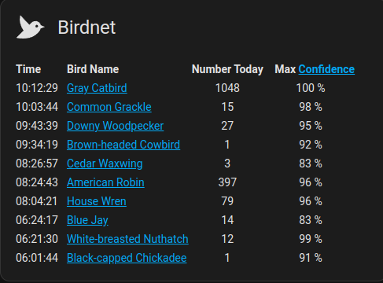
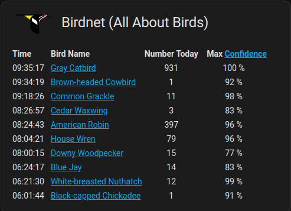

# BirdNET-Go Addon: Home Assistant Integration

BirdNET-Go can be integrated with Home Assistant using a MQTT Broker.

## MQTT Configuration

Your Home Assistant must be setup with MQTT and BirdNET-Go MQTT integration must be enabled. Modify the BirdNET-Go config.yaml file to enable MQTT. If you are using the Mosquitto Broker addon, you will see a log message during the BirdNET-Go startup showing the internal MQTT server details needed for configuration similar to below.

```text
BirdNET-Go log snipped showing MQTT details:
/etc/cont-init.d/33-mqtt.sh: executing
---
MQTT addon is active on your system! Add the MQTT details below to the Birdnet-go config.yaml :
MQTT user : addons
MQTT password : Ri5ahV1aipeiw0aelerooteixai5ohtoeNg6oo3mo0thi5te0phiezuge4Phoore
MQTT broker : tcp://core-mosquitto:1883
---

Edit this section of config.yaml found in addon_configs/db21ed7f_birdnet-go/:
    mqtt:
        enabled: true # true to enable MQTT
        broker: tcp://core-mosquitto:1883 # MQTT (tcp://host:port)
        topic: birdnet # MQTT topic
        username: addons # MQTT username
        password: xxxxxxxxxxxxxxxxxxxxxxxxxxxxxxxxxxxxxxxxxxxxxxx # MQTT password
```

## BirdNET-Go MQTT Sensors

Add the [MQTT sensor](https://www.home-assistant.io/integrations/sensor.mqtt/) yaml configuration below to your Home Assistant configuration.yaml file. Reload the configuration and once BirdNET-Go publishes a new finding to MQTT the new BirdNET-Go sensors should show that latest finding data.

```yaml
mqtt:
  sensor:
    - name: "Birdnet-Go"
      state_topic: "birdnet"
      value_template: "{{ today_at(value_json.Time) }}"
      json_attributes_topic: "birdnet"
      json_attributes_template: "{{ value_json | tojson }}"
    - name: "Birdnet-Go Bird Image Url"
      state_topic: "birdnet"
      value_template: "{{ value_json.BirdImage.URL }}"
    - name: "Birdnet-Go Clip Name"
      state_topic: "birdnet"
      value_template: "{{ value_json.ClipName }}"
    - name: "Birdnet-Go Common Name"
      state_topic: "birdnet"
      value_template: "{{ value_json.CommonName }}"
    - name: "Birdnet-Go Confidence"
      state_topic: "birdnet"
      value_template: "{{ (value_json.Confidence | float * 100) | round(2) }}"
      unit_of_measurement: "%"
    - name: "Birdnet-Go Date"
      state_topic: "birdnet"
      value_template: "{{ value_json.Date }}"
    - name: "Birdnet-Go ProcessingTime"
      state_topic: "birdnet"
      value_template: "{{ (value_json.ProcessingTime | float / 1000000000 ) | round(4) }}"
      unit_of_measurement: "s"
    - name: "Birdnet-Go Scientific Name"
      state_topic: "birdnet"
      value_template: "{{ value_json.ScientificName }}"
    - name: "Birdnet-Go Sensitivity"
      state_topic: "birdnet"
      value_template: "{{ value_json.Sensitivity }}"
    - name: "Birdnet-Go Source"
      state_topic: "birdnet"
      value_template: "{{ value_json.Source }}"
    - name: "Birdnet-Go Species Code"
      state_topic: "birdnet"
      value_template: "{{ value_json.SpeciesCode }}"
    - name: "Birdnet-Go Threshold"
      state_topic: "birdnet"
      value_template: "{{ value_json.Threshold }}"
    - name: "Birdnet-Go Time"
      state_topic: "birdnet"
      value_template: "{{ today_at(value_json.Time) }}"
```


## BirdNET-Go Events Sensor[^1]

Then create a new template sensor using the configuration below.

```yaml
- trigger:
    - platform: mqtt
      topic: "birdnet"
    - platform: time
      at: "00:00:00"
      id: reset
  sensor:
    - unique_id: c893533c-3c06-4ebe-a5bb-da833da0a947
      name: BirdNET-Go Events
      state: >
        
          {{ now() }}
        
          {{ today_at(trigger.payload_json.Time) }}
        
      attributes:
        bird_events: >
          
            {{ [] }}
          
            
            
            {% set confidence = trigger.payload_json.Confidence|round(2) * 100 ~ '%' %}
            
            
            {{ current + [new] }}
          
```

### BirdNET-Go Dashboard Cards

There are two versions listed below. The first example will link the Bird Name to Wikipedia. The other example will link to All About Birds. You will need to modify the Confidence link to match your Home Assistant setup.



```yaml
type: markdown
title: BirdNET (Wikipedia)
content: >-
  Time|&nbsp;&nbsp;Bird Name|Number Today| &nbsp;&nbsp;&nbsp;Max
  [Confidence](http://ip_address_of_HA:8080/)

  :---|:---|:---:|:---:

  

  

  

  

  

  

  {%- set ubird_max_confidence = ((bird_objects | selectattr("name", "equalto",
  thisbird)) | map(attribute='confidence') | map('replace', '%', '') |
  map('float') | max | round(0)) %}

  

  {{ubird.time}}
  |&nbsp;&nbsp;[{{ubird.name}}](https://en.wikipedia.org/wiki/{{ubird.name |
  replace(' ', '_')}}) | {{ubird_count}} | {{ ubird_max_confidence }} %

  

  
card_mod:
  style:
    $: |
      .card-header {
        display: flex !important;
        align-items: center;
      }
      .card-header:before {
        content: url("data:image/svg+xml,%3Csvg xmlns='http://www.w3.org/2000/svg' viewBox='0 0 24 24'%3E%3Cpath fill='%23000' d='m23 11.5l-3.05-1.13c-.26-1.15-.91-1.81-.91-1.81a4.19 4.19 0 0 0-5.93 0l-1.48 1.48L5 3c-1 4 0 8 2.45 11.22L2 19.5s8.89 2 14.07-2.05c2.76-2.16 3.38-3.42 3.77-4.75zm-5.29.22c-.39.39-1.03.39-1.42 0a.996.996 0 0 1 0-1.41c.39-.39 1.03-.39 1.42 0s.39 1.02 0 1.41'/%3E%3C/svg%3E");
        height: 42px;
        width: 42px;
        margin-top: 0px;
        padding-left: 0px;
        padding-right: 14px;
      }
      @media (prefers-color-scheme: dark) {
        .card-header:before {
          content: url("data:image/svg+xml,%3Csvg xmlns='http://www.w3.org/2000/svg' viewBox='0 0 24 24'%3E%3Cpath fill='%23E1E1E1' d='m23 11.5l-3.05-1.13c-.26-1.15-.91-1.81-.91-1.81a4.19 4.19 0 0 0-5.93 0l-1.48 1.48L5 3c-1 4 0 8 2.45 11.22L2 19.5s8.89 2 14.07-2.05c2.76-2.16 3.38-3.42 3.77-4.75zm-5.29.22c-.39.39-1.03.39-1.42 0a.996.996 0 0 1 0-1.41c.39-.39 1.03-.39 1.42 0s.39 1.02 0 1.41'/%3E%3C/svg%3E");
          height: 42px;
          width: 42px;
          margin-top: 0px;
          padding-left: 0px;
          padding-right: 14px;
        }
      }
```



```yaml
type: markdown
title: BirdNET (All About Birds)
content: >-
  Time|&nbsp;&nbsp;Bird Name|Number Today| &nbsp;&nbsp;&nbsp;Max
  [Confidence](http://ip_address_of_HA:8080/)

  :---|:---|:---:|:---:

  

  

  

  

  

  

  {%- set ubird_max_confidence = ((bird_objects | selectattr("name", "equalto",
  thisbird)) | map(attribute='confidence') | map('replace', '%', '') |
  map('float') | max | round(0)) %}

  

  {{ubird.time}}
  |&nbsp;&nbsp;[{{ubird.name}}](https://www.allaboutbirds.org/guide/{{ubird.name
  | replace(' ', '_')}}) | {{ubird_count}} | {{ ubird_max_confidence }} %

  

  
card_mod:
  style:
    $: |
      .card-header {
        display: flex !important;
        align-items: center;
      }
      .card-header:before {
            content: url("");
            height: 20px;
            width: 60px;
            margin-top: -10px;
            padding-left: 8px;
            padding-right: 18px;
      }
```

## Footnotes

[^1]: [Displaying Birdnet-go detections](https://community.home-assistant.io/t/displaying-birdnet-go-detections/713611/22)
